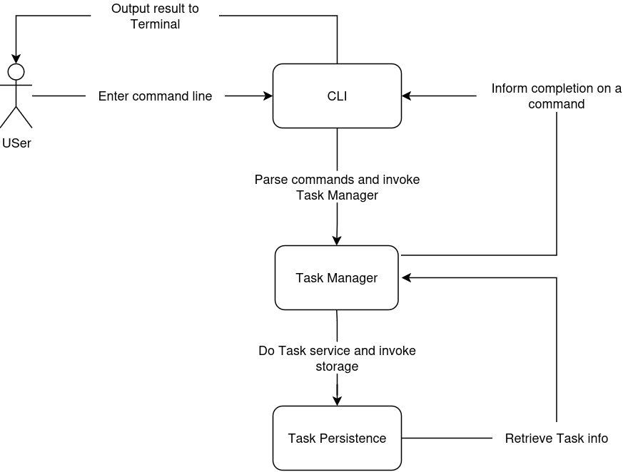

# EXERCISE - DESIGN PHASE

## PROBLEM

The specification phase has defined a small command-line task manager.

The system must allow the user to:

* Create a task with a title.
* List all tasks.
* Mark a task as completed using its ID.
* Delete a task using its ID.
* Keep tasks after the program exits by using persistent storage such as a JSON file.

For this design exercise, a task also has:

* Task ID
* Title
* Start time
* Due time

The task status is:

```text
Before start time       → TODO
During task period      → DOING
After due time          → OVERDUE
User completes task     → DONE
```

---

# QUESTION

## Define the system architecture

### Answer

The system is divided into three main components:

* CLI -> Responsible for interacting with the user through the terminal.
* Task Manager -> Responsible for task-related application logic.
* Task Repository -> Responsible for storing and retrieving tasks.

The architecture can be viewed .

---

## Define major components

### 1. CLI

The CLI is the user interface of the application.

Its responsibilities are:

* Receive command-line input.
* Parse the command and its arguments.
* Check command syntax.
* Call the appropriate Task Manager operation.
* Display the result or error message.

---

### 2. Task Manager

The Task Manager contains the application's task-related logic.

Its responsibilities are:

* Create a task.
* Delete a task.
* List tasks.
* Complete a task.
* Calculate the current status of a task.

Its main operations are:

```text
create_task(...)
delete_task(task_id)
list_tasks()
complete_task(task_id)
```

---

### 3. Task Repository

Task Repository is responsible only for storing and retrieving task data.

Its responsibilities are:

* Load tasks from storage.
* Retrieve a task by ID.
* Retrieve all tasks.
* Save a new or updated task.
* Delete a task from storage.

Its interface is:

```text
get_task(task_id)
get_all_tasks()
save_task(task)
delete_task(task_id)
```

---

## Define the interfaces between components

### Answer

An interface defines **what one component can ask another component to do**.

1. CLI → Task Manager

   The CLI can call:

   ```text
   create_task(title, start_time, due_time)
   delete_task(task_id)
   list_tasks()
   complete_task(task_id)
    ```

   The Task Manager returns a result such as:

   ```text
   Success
   Task not found
   Invalid task
   ```

   The CLI converts that result into terminal output.


2. Task Manager → Task Repository

   The Task Manager can request storage operations:

   ```text
   get_task(task_id)
   get_all_tasks()
   save_task(task)
   delete_task(task_id)
   ```

   Example:

   ```text
   Task Manager
       ↓
   get_task(5)
       ↓
   Task Repository
       ↓
   Task 5
   ```

   Or:

   ```text
   Task Manager
       ↓
   save_task(task)
       ↓
   Task Repository
       ↓
   tasks.json
   ```

   The Task Manager does not directly manipulate the JSON structure.

---


## Define the data model

### Answer

The system contains one main data entity: `Task`.

```text
Task
    task_id
    title
    start_time
    due_time
    completed
```

A task is uniquely identified by `task_id`.

Example:

```text
Task
    task_id: 1
    title: "Study software engineering"
    start_time: 2026-09-19 09:00
    due_time:   2026-09-19 12:00
    completed: false
```

`status` does not need to be stored directly.  
It can be calculated from the task's time information and completion state.

```text
if completed
    → DONE

else if current time < start_time
    → TODO

else if current time <= due_time
    → DOING

else
    → OVERDUE
```

---

## Define the storage design

### Answer

A JSON file is used for persistent storage.

```json
[
  {
    "task_id": 1,
    "title": "Study software engineering",
    "start_time": "2026-09-19T09:00:00",
    "due_time": "2026-09-19T12:00:00",
    "completed": false
  }
]
```

The JSON file is an implementation detail of `Task Repository`.

---

## Define the main system behavior

### Answer

1. Create task

   ```text
   User
    ↓
   CLI
    ↓
   create_task(...)
    ↓
   Task Manager
    ↓
   create Task object
    ↓
   Task Repository.save_task(task)
    ↓
   result
    ↓
   CLI
    ↓
   "Task created with ID 1."
   ```


2. List tasks

   ```text
   User
    ↓
   CLI
    ↓
   list_tasks()
    ↓
   Task Manager
    ↓
   Task Repository.get_all_tasks()
    ↓
   tasks
    ↓
   Task Manager calculates current status
    ↓
   result
    ↓
   CLI
    ↓
   display tasks
   ```

   Example output:

   ```text
   ID   Status    Title
   1    TODO      Study software engineering
   2    DONE      Finish assignment
   ```


3. Complete task

   ```text
   User
    ↓
   CLI
    ↓
   complete_task(1)
    ↓
   Task Manager
    ↓
   Task Repository.get_task(1)
    ↓
   mark task as completed
    ↓
   Task Repository.save_task(task)
    ↓
   result
    ↓
   CLI
    ↓
   "Task 1 completed."
   ```


4. Delete task

   ```text
   User
    ↓
   CLI
    ↓
   delete_task(1)
    ↓
   Task Manager
    ↓
   check task exists
    ↓
   Task Repository.delete_task(1)
    ↓
   result
    ↓
   CLI
    ↓
   "Task 1 deleted."
   ```

---

## Note on common mistakes

### Storing a time-dependent status directly

Bad:

```text
{
    "status": "DOING"
}
```


Better:

```text
completed
start_time
due_time
```

Task Manager calculates the current status when needed.

### Making interfaces too vague

Bad:

```text
Task Manager asks Repository to handle data.
```

Better:

```text
get_task(id)
get_all_tasks()
save_task(task)
delete_task(id)
```

An interface becomes useful when it defines what another component can actually request.

